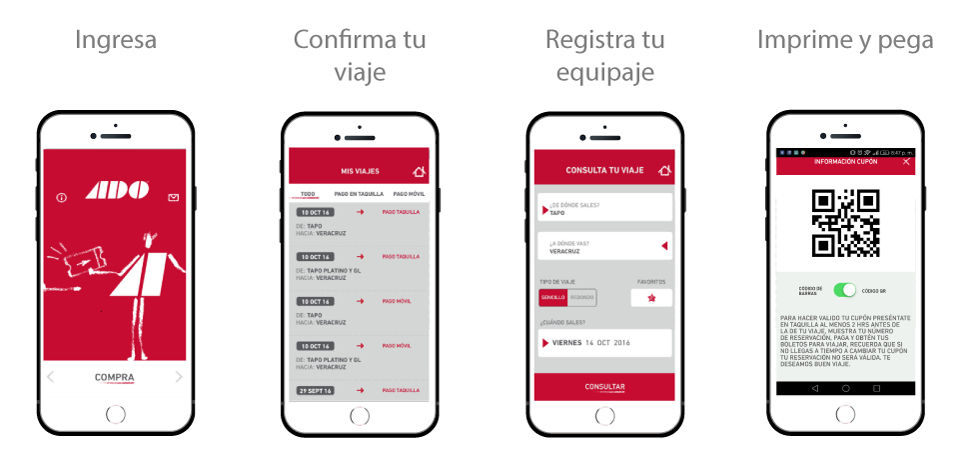
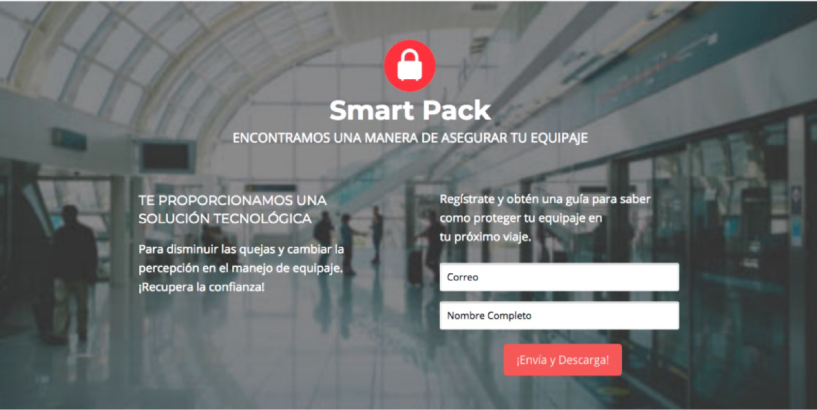
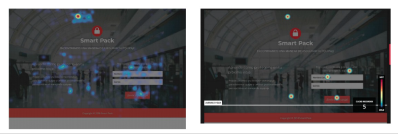

## SmartPak

Previsualización

## PROBLEMATICA

Las líneas de autobuses no cuentan con un método efectivo de registro de equipaje en viajes cortos (Ciudad de México - Cuernavaca).

Como consecuencia del mal manejo del equipaje, los usuarios generan quejas y denuncias por las molestias y perdidas.

Por lo tanto disminuyendo la probabilidad de que el usuario regrese a usar el servicio y/o provocando una mala imagen de la marca a nuevos usuarios.

## OBJETIVO DE NEGOCIO

Proporcionar una solución tecnológica para
disminuir las quejas y cambiar positivamente la
percepción de la marca especíFcamente en el
manejo de equipaje.

## PERFIL DE USUARIO

* Usuarios del trayecto CDMX - Cuernavava ida y vuelta
* Usuarios que viajan con equipaje voluminoso
* Empleado - trabajador o comerciante
* Clase Media-Baja

## NECESIDADES DE USUARIO
- Necesidad de un buen manejo de su equipaje
- Un registro eciente
- Tener conanza en el proceso de manejo de
equipaje

## INSIGHTS

1. Necesidad de un buen manejo de su equipaje
2. Un registro eciente
3. Tener conanza en el proceso de manejo de
equipaje

## SOLUCIÓN PROPUESTA
Proporcionar una solución tecnológica para
disminuir las quejas y cambiar positivamente la
percepción de la marca especícamente en el
manejo de equipaje.

## BENEFICIO CLAVE

1. Brindar un registro de equipaje eciente.
2. Usuarios reconozcan un buen servicio de
manejo de equipaje
3. Brindar segurar de registro e información a
partir del código QR

## ¿CÓMO FUNCIONA?

## LANDING PAGE

## INSIGHTS IMPORTANTES

* Reporte Del Flujo Del Comportamiento
* Analizar el comportamiento de los usuarios
* Máximo rendimiento de nuestra landing page

Colaboradores:

* Jessy Cuevas
* Daniela Serrano
* Angelica Rivera
